# Git and GitHub

If you're reading this, you're probably reading it on GitHub. Hopefully, by now you recognize that GitHub is a "cloud storage" database for code, like a specialized version of Google Drive or Microsoft OneDrive.

**GitHub** and **git** are not the same thing; they are two individual programs that work very closely together. Google Docs/Slides/Sheets and Google Drive are not the same thing, but they are naturally integrated with each other.

GitHub is what's called a *version control* system.

> **[Version control](https://en.wikipedia.org/wiki/Version_control)** is the practice of controlling, organizing, and tracking the versions of files.

Google Drive applications have much smaller version control systems built in which allow you to revert a document to a previous save (Go look: it's the clock-arrow icon in the top right corner). For example, if you revise the paragraph of an essay in Google Docs but decide your previous wording was better, you can use the version control to revert the document to that previous state. GitHub serves the same purpose, but has a vastly expanded toolset to better suit writing code.

## Git Locations

Before we get into git's commands, I'd like to tell you about how it's structured. This hopefully will provide some context to what you're doing when you "add, commit, and push" your code.

First, your computer is its own space that has three segments: the *workspace*, the *index*, and the *local repository*.You'll mainly be concerned about the *workspace* and the *local repository*; the index isn't something we need to talk about.

* The *workspace* is wherever you're working right now. In Google Colab, your specific notebook would be your workspace. Moving forward, your Problem Set workspace will be your text editor (presumably Visual Studio Code).
* The *index* is a middle ground between the workspace and local repository. It's a "staging ground" for code you're pretty sure is okay, but want to check one last time before pushing.
* The *local repository* (local) is the most recent "confirmed" version of the code you're working on. Code here is presumably ready to be put on GitHub.

Second, *GitHub*, as you know, is the cloud. We often refer to it as **remote**, while Git usually refers to it as **origin**. Remember that *what you see in local is not automatically updated on remote*. If your code is not on GitHub, your professors and the TA's cannot see it. **Always rememeber to make sure that your most recent commits are on GitHub by going directly to the [repository on the GitHub website](https://github.com/) to double check.**

### Cargo Plane Analogy

Think of Git as a system that (mostly) mirrors the journey of a package you send through the mail. I'll reference the image below as we go through the examples, so keep it in mind if it helps you understand what's happening.

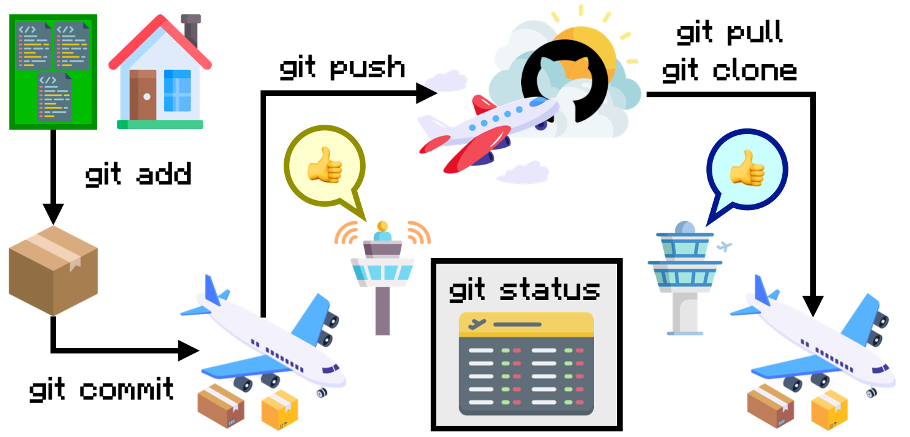

## Git Commands and Moving Code

### `status` - Check Current State

Before we start walking through each Git command, let's talk about a command that you can use at any point to understand where you are in the process.

> `git status` shows you the current state of your code in version control. This includes what "stage" of the process that you have code in, the number of lines changed, and any files that were added, changed, or removed since the previous version.

This is your flight schedule. Anything you need to know about your package-in-transit can be found here. As an example output, here's a `git status` from this repository as I work on this file.

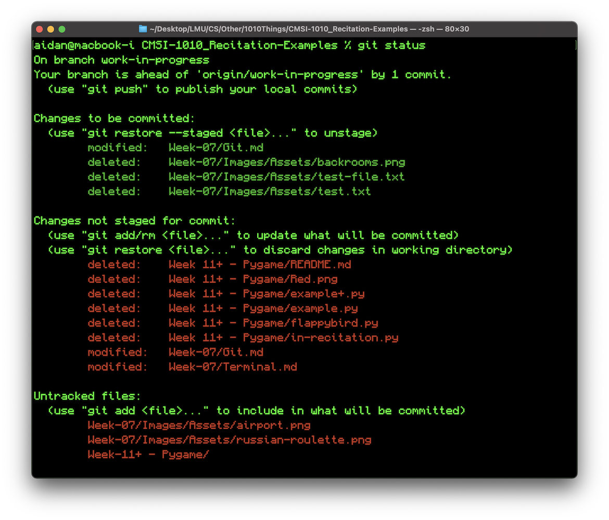

There's a lot of information here, but notice that there are three "stages" we can see, using our airport analogy:

* `Changes to be committed`: These changes are boxed up and ready to be loaded onto the plane at any notice.
* `Changes not staged for commit`: These changes are on our list to be boxed up for the airport, but we haven't packed them yet.
* `Untracked files`: These changes are just lying around. They're not even on a packing list! They were just added (or renamed), so we can see them but haven't decided yet if we're going to ship them later.

Here's another.

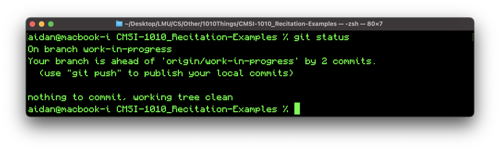

* `Your branch is ahead of 'origin' by 2 commits`: I have 2 "boxes" already loaded into the plane, but it hasn't yet taken off yet.
* `Nothing to commit, working tree clean`: I don't have any packed boxes laying around; all my boxes are already on the plane.

This information is probably daunting, but don't worry! Hopefully it'll make more sense as we go through the other commands.

You'll probably use `git status` frequently in the beginning, and use it less as you get more comfortable with the system. Still, there's no harm in checking often!

### Outgoing Changes

These three commands are for "outgoing" changes, relative to your local repository. Here, you're packing your boxes, loading them into the airplane, and finally watching the plane take off.

#### `add` - Prepare Suggested Changes

The first thing to do when you have something to ship is to pack it up.

> `git add [FILE1] [FILE2] ...` tells Git to track the changes to `FILES` for the next commit, on a per-file basis. After running `git add`, we say that the `added` changes have been **staged for commit**.
> `git add .` tells Git to stage **all** current changes across all files.

Expanding on our analogy, you can put as much as you want into a box before sealing it up. If you want to do your entire assignment before doing a single `git add .`, you technically can. However, that's not recommended since it entirely beats the purpose of having version control; you can't scroll through different versions of code if your only two versions are "haven't done anything" and "finished everything," neither of those are particularly helpful to look back on.

An example is provided. Here, I'm staging my changes to `Git.md` (this file, as I write it!) and also include the images below.

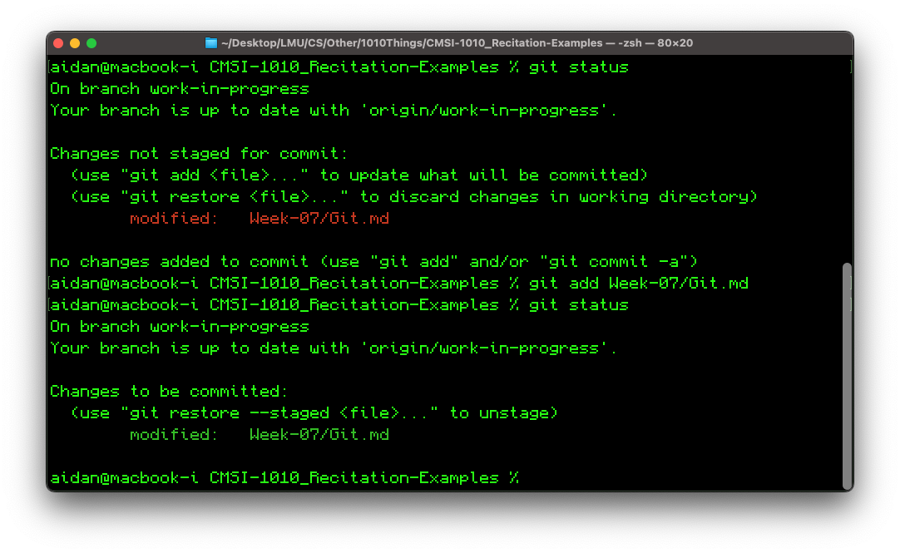

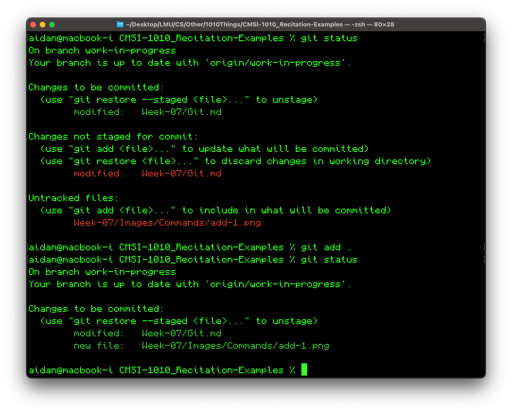

If you're only working on one file at a time, `git add .` is probably fine. `git add [FILE]` is more helpful in projects where multiple files are closely connected, and you're trying to slowly make changes across each file one at a time.

#### `commit` - Solidify Local Changes

Once everything's in your box, you seal it up and put a label on it. Then, unless you intend to deliver the package yourself, you need to make sure that you give it to a carrier. Of course, once you give the package gets onto the plane, there's no takebacks; you can't change the label or open the package back up anymore.

> `git commit` confirms staged changes, and bundles them together as a single **version** (or **commit**) of the whole codebase.
> Commits require a **commit message**, which we add with the tag and parameter `-m "[MESSSAGE]"`

Putting those two together, `git commit -m "[MESSAGE]"` confirms **all current staged changes** and gives them the label `MESSAGE`.

Your commit message should be brief and descriptive: basically, what did you do? What changed in the code? For example, you should do a commit every time you complete a question on your problem set. Your commit messages for each commit should probably look something like `finished [PROBLEM NAME]`. If you're done with the problem set, your commit message probably looks something like `finished [PROBLEM NAME]; completed problem set`.

Here are examples. Once again, these are straight from me as I write this document! Once it's on GitHub, you should be able to find these exact commit messages.

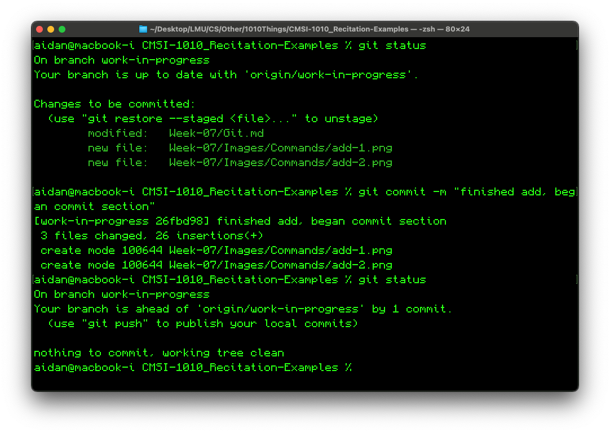

Notice a few things in this screenshot:

* Git acknowledges how many files changed (`3 files changed`) and by how much they changed (`26 insertions(+)`; if I had deleted things, there would be deletions)
* Git notices that one file was modified (`Week-07/Git.md`) and two files are brand new (`Week-07/Images/Commands/add-1.png` and `Week-07/Images/Commands/add-2.png`)
* Git tells you how many "commits" you currently have stored (`Your branch is ahead of 'origin/work-in-progress' by 1 commit.`).

Once you commit changes, they're locked in; there's no changing them anymore. Whatever was just committed is solidified as its own version of the code, a snapshot of the codebase at that time. That's not to say that the files can't be changed later on; just that those changes will be marked under a different version.

Commits are where we get the "version" in "version control.

#### `push` - Send Local Changes to Remote

You can put as many packages as you want onto the plane (ignoring the limitations of physical space), but none of those packages are going anywhere until the plane closes up and takes off into the cloud.

> `git push` sends all of your **local** commits to **remote**.

The two previous commands, `add` and `commit`, have been leading up to this. It doesn't matter how many commits you've made on your local repository. If you don't `push` your code, nobody can see it. Your teacher can't see it, the TAs grading your assignments can't see it, and, if you go directly to the GitHub website, not even you can see it.

It's the most important, but also the simplest command. It's just `git push`. No extra parameters. All the hard work of "creating" versions is done in `git add` and `git commit`, so all `git push` does is update remote.

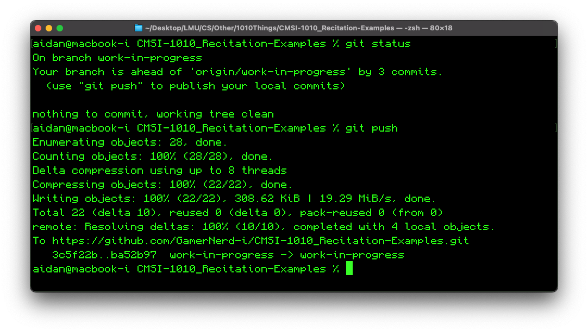

A crucial thing to note is that you don't need to `push` after every `commit`. In this example, I'm pushing 3 different commits. Each of those commits has their own set of changes and its own commit message. If I go to the repository directly, I can see what each of those commits were:

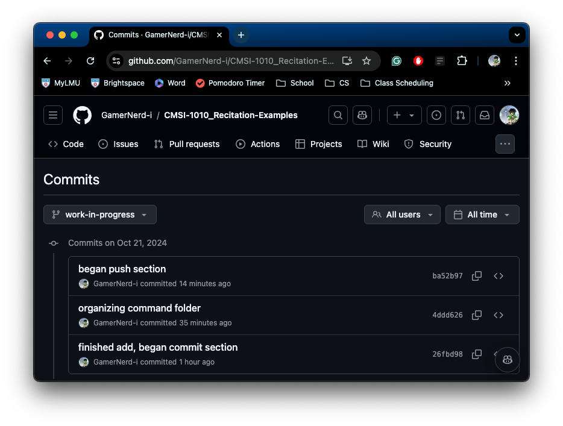

Your last step of any sequence `add`, `commit`, `push` should **always** be to check GitHub to ensure that your push was successful. If your push was successful, your terminal will say it anyway, but it doesn't hurt to double check while you're still learning the system.

### Incoming Changes

These two commands are for "incoming" changes -- changes that you need to bring from GitHub to your local repository. They may look very similar, but they serve different purposes. Either way, you can think of this as air traffic control flagging down the plane to land.

#### `clone` - Retrieve Remote Repository

When you start working on a brand-new repository, whether that's a new problem set or the start of a group project (which you will be doing at the end of this class!), you need to use `git clone` to get it from GitHub.

> If you need a repository that's **on GitHub but not local at all**, you run `git clone`.
> `git clone [URL]` copies the repository at `URL` into the current folder.

The URL is taken directly from the GitHub repository, as follows.

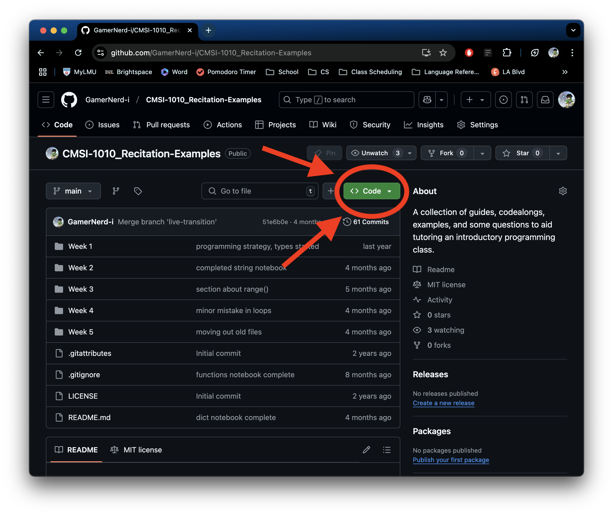
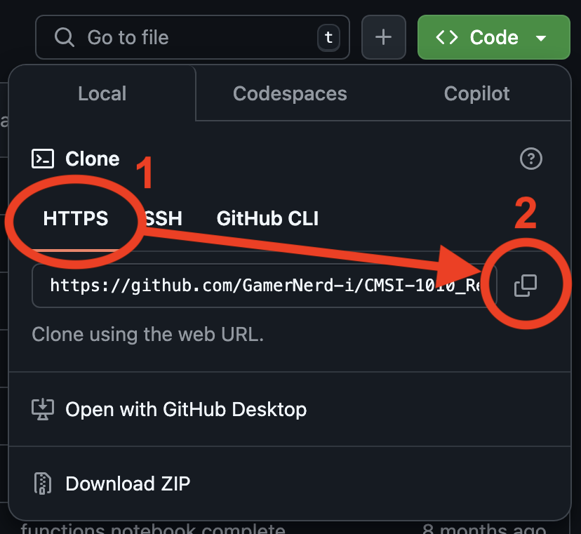

Technically, you can also take the URL directly from your browser bar, but don't do that, because the URL will change as you explore the repository.

You might notice that there are other ways to get the code, such as using GitHub Desktop or downloading a ZIP file. It's good to keep these options in mind if the situation calls for it, but generally, all you need is the URL for `git clone`.

Let's take a look at what git looks like after cloning a repository.

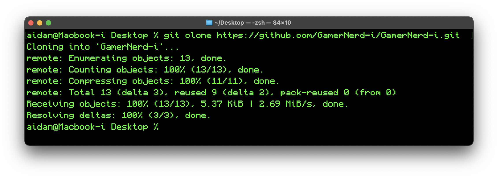

Although this is only the "finished" screen, while the repository is cloning you'll be able to see each item's progress in real time. Larger repositories will take more time since there's more to download.

#### `pull` - Update Local with Remote Changes

We saw `push` earlier, so of course we need the opposite as well.

> `git pull` retrieves all **remote** changes for the current repository that are not yet on **local.**

`pull`ing is **very important** because it ensures your workspace, the **local** space, is always up to date with all your other workspaces. Many programmers work on the same project from multiple devices at once, so ensuring that all those devices are up to date is crucial. Here's what a successful (and safe) `git pull` looks like. Notice that this terminal is on a completely different device from the other examples!

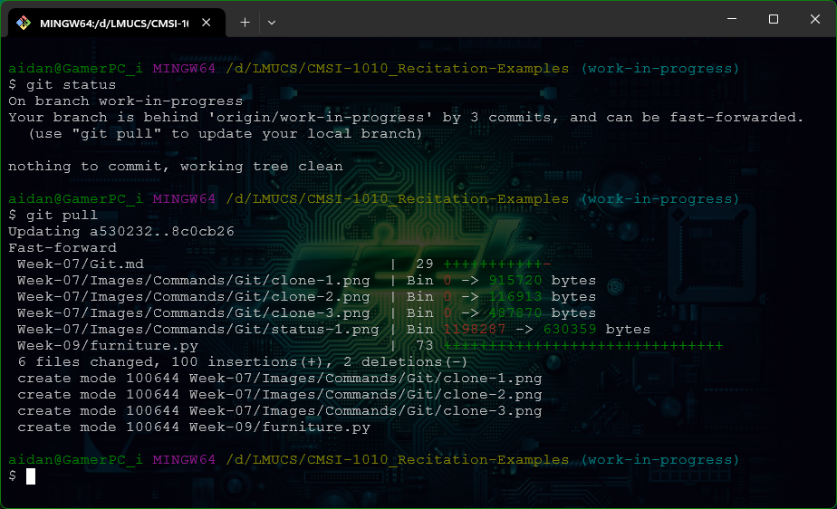

Notice that `pull` tells you what changes are coming onto your device. In this case, I'm bringing in a lot of images, and Git is performing a `Fast-forward` action. That's all fine; it just means that it's getting my local repository to "catch up" to the remote.

`pull` and `push` become even more crucial once your repository starts being shared among multiple people. Ensuring that you and your partners keep both local and remote repositories updated prevents **merge conflicts**, which we'll go into detail later. For now, just know that encountering a merge conflict is somewhat of a pain to deal with, but entirely avoidable as long as everyone remembers to `push`, `pull`, and coordinate.

Be aware that there will be no warning from Git that you have not `pull`ed before you start to work. `pull`ing needs to be *your* habit as the user.

### Tips and a Warning

The purpose of this markdown file was to introduce the key commands necessary to use `git`. They each have their purposes, but using `git` as a whole requires an understanding of how they all work together to maintain a code base. `git` takes practice, and what's covered here is only the beginning. It's not necessary difficult; the most difficult part is forming the habits necessary to use `git` effectively.

To get you started, here are three key things to keep in mind.

#### Commit Often

Remember that although we're using GitHub as a mode of assignment submission, `git` is, first and foremost, for **version control.** Version control is of little use if you don't create "versions" to look through as you go about your project. Being able to backpedal onto a previous version of the code is the whole point of version control. So the first tip is to make sure you're creating more versions to control:

> **``commit`` often, ``push`` once.**

**Commit often** means that you commit after every "section" of code, not just at the end. **Push once** doesn't *literally* mean push once per assignment, but you don't need to `push` after every `commit`. For example, your assignments from now on will usually be divided into multiple Python files, which themselves may be divided into multiple blocks of code (functions, classes, etc.). It's a good idea to `commit` after each section, and `push` once you're done working for the day, or at when you finish a file.

The question of how many commits is the right number of commits has multiple answers, but people tend to agree that more commits are better, since that means there are more checkpoints to roll back your code to.

You won't necessarily need to roll back code to a previous version in this class; in fact, we haven't even covered how to do that. Either way, the importance of this habit stands.

#### Always Pull First

At this point, you're probably familiar enough with managing cloud data to understand that both sides need to be synchronized to ensure that nothing goes wrong, whether that's cloud saves for a game or even something as simple as a shared Google Doc. As we said before, `git` won't perform these syncs automatically: you (and your team) need to do it yourself. With `git`, as with any cloud data service, `remote` should always be the most up-to-date version at any time so that `local` workspaces can start from the most recent version. That brings us to our tip:

> ***ALWAYS* ``pull`` first.**

The first thing you *always* do when you sit down to work on a GitHub repository is run `git status` and `git pull` to make sure that your local repository is up to date with the latest changes, whether those changes are from your teammates or just you working on a different device.

The difficulty of this tip for beginners is forming the habit of running `git pull` before jumping back into code. It becomes second nature eventually, but until then you will need to make a conscious effort to `pull` first -- and to remind your groupmates to `pull` first as well.

#### Merge Conflicts
