# Terminal

If you've seen pictures of old computers, pictures of "hackers", or *The Matrix* you probably have some idea of what the terminal/command line/shell looks like; colloquially you might also call it "the terminal." In case you don't, here are some examples:

That looks terrifying, doesn't it? It's so high-tech looking and advanced!

And with that, let me show you what my terminal actually looks like when you open it up:

That doesn't look so bad, does it? If you're still scared, that's entirely valid. The command-line is an extremely powerful tool that has the potential to do serious, potentially irreversible damage *if* you go off the beaten path. You shouldn't need to go off the beaten path for this class. Just stay on the path(s) we lay out for you and you'll be fine.

## Command Line vs. Terminal vs. Shell

Let's clear up one key bit of terminology before we start:

> For the purposes of this class, **terminal**, **command line**, and **shell** refer to the same thing: a text-only interface that lets you explore files and execute commands.

All three have varying origins. For example, "terminal" comes from "computer terminals" which were the only way to access a computer or computer network's functions. This isn't information you need to know, but if you're interested you can take a look at [this Reddit post](https://www.reddit.com/r/learnprogramming/comments/6xr0l9/whats_the_difference_between_terminal_shell/) which explains their origins pretty well.

> For consistency, I will be using the term "shell" throughout this and subsequent notebooks.

Your computer should already have some kind of shell built in. If you're on a Mac, you have an app called Terminal; on Windows, the equivalent is Command Prompt. Unfortunately, Mac and Windows have two different shell languages, so **if you're a Windows user we want you to download and use [Git Bash](https://git-scm.com/downloads)** to keep the commands consistent (this installation should have already been done in class).

## Commands

The whole point of your shell is to use commands. Many of them perform functions that your file explorer (called Finder on Mac) are able to do normally, but the shell is capable of going into places that Finder normally hides from you. This also means that it's capable of editing or even deleting items that normally should not be touched.

Once again, you shouldn't have to go into those places for this class, so you shouldn't have to worry about things like deleting System32 or bricking your computer.

### File Navigation

In your computer, your files are set up like Russian dolls. A folder can contain multiple folders and files, and those folders may contain even more folders! The problem with this comparison is that it's hard to imagine putting physical folders inside of other folders. The real term for a "folder" is a *directory*.

> A **directory** is a file on your computer that contains other files, which may also be directories. In other words, directories and folders are the same thing.

A "directory" outside of computing *directs* people to things they need, such as a specific doctor's office in a medical building. That's how they got their name: they direct users to files that were placed in them.

With this in mind, I like to think of your computer and its directories as a house with a bunch of rooms. Each directory is a room; while you're standing in that room, you can only see items in that room (files), doors to the next rooms (directories), or the door you came in from.

Here's a "map" of this analogy in action for (most of) the `Week-07` folder in this repo:

Let's get started with your navigation commands, using our visual to help us through it. I recommend downloading `Week-07` to your computer and following along if you can. To get to the right place, follow these steps:

1. Open your shell: **Terminal** for Macs, or **Git Bash** (NOT Command Prompt!) for Windows. You should see a line that looks something like `[USER]@[PCNAME] ~ %` with a cursor already ready to go.
2. Type `cd` and a space. I will explain this command very soon -- for now, just know that it moves your shell to the directory specified.
3. Find the `Week-07` folder that you downloaded in your usual File Explorer: Mac's is called Finder.
4. Drag the `Week-07` folder into your shell window. This should add a filepath, something along the lines of `/Users/[USER]/Downloads/Week-07`. On Mac, this includes `Users`, but on Windows you will probably see `C:/` instead.
5. Hit ENTER to run the command. Your shell should now say something like `[USER]@[PCNAME] Week-07 %`.
6. If you want, type `clear` and hit ENTER to wipe the previous command and start with a fresh template.

I will be using a Mac for the following examples, so my shell is **Terminal**. If you're a Windows user, as long as you're using **Git Bash** your commands will be identical.

#### `ls` - List Items

We can check what items we can "see" in our current shell position by using the `ls` command.

> The list command `ls` lists all items in the current directory.

Think of this like taking a second to look around the room for anything of interest. It helps us get our bearings if we're not sure if we're in the right directory.

Run the command in your shell. It should look something like this:

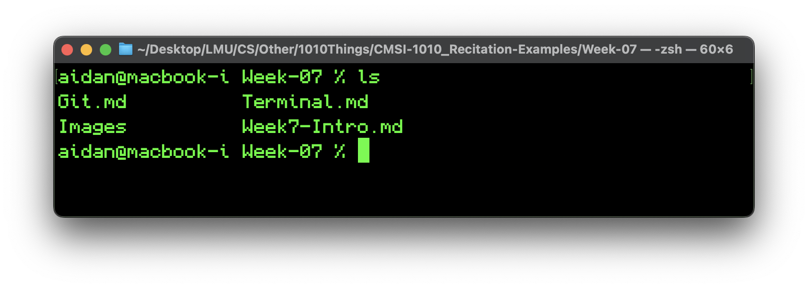

You can check both your file explorer and our map above to confirm that these are, in fact, the items in this room.

#### `cd` - Change Directory

> The **c**hange **d**irectory command `cd [FILEPATH]` moves our shell to the directory given by `FILEPATH`.

`cd` lets you follow a (file)path to walk to a specific room. That room can be just next door, or several doors down. Just don't try to walk into a room that doesn't exist!

`cd` assumes that your path is **relative**: that it starts from the current room. You can also give a path that is **absolute**. An absolute filepath begins all the way at the **root**, which for us would be the very front door of our house.

> The **root** is the highest level of your file system, from which you can access every other file on your computer.
>
> * On a Mac, the root is denoted by a tilde (`~`).
> * On Windows, the root is denoted by a lettered drive, usually `C:/`.

Let's move into the `Memes` directory. Run `cd Images/Memes`, and then run `ls` again to check what we can see. Your shell should look like the following:

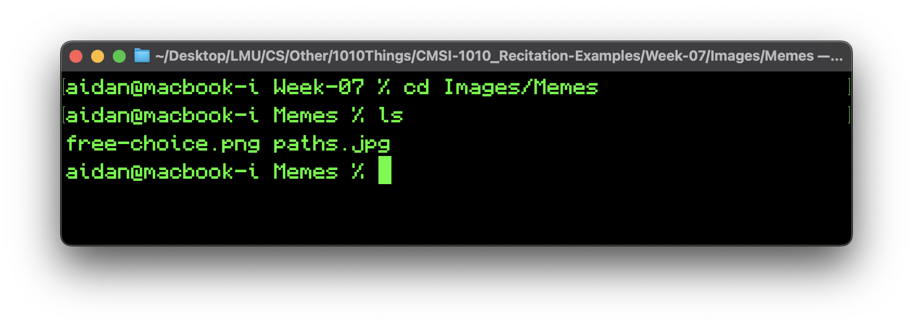

Once again, check your file explorer to confirm that our shell has moved into the `Memes` folder. We can update our map with our current location as well:

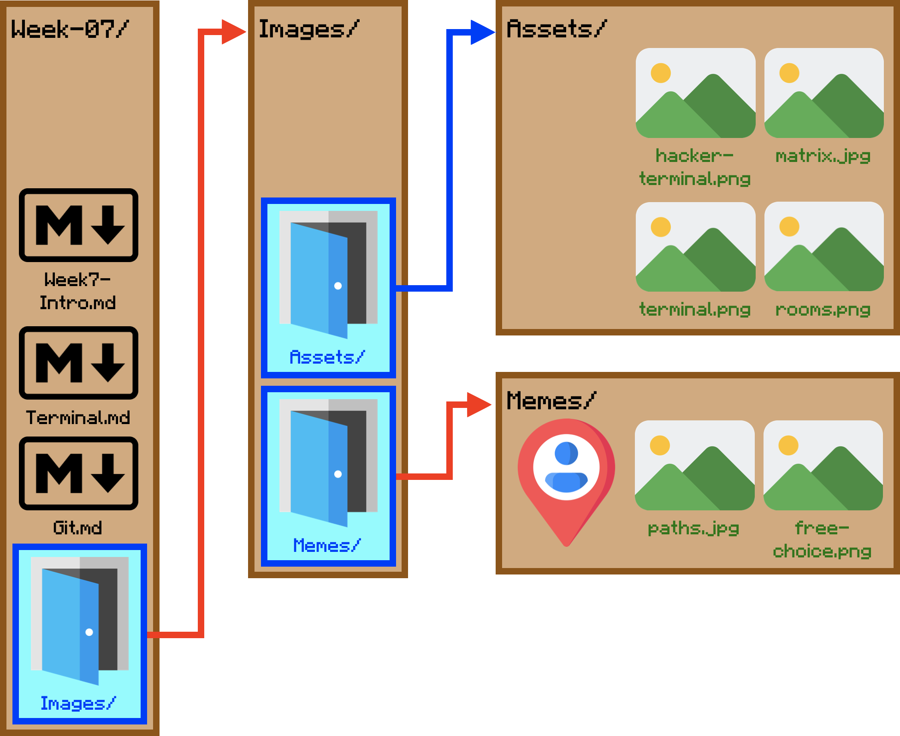

Let's say we want to move to `Assets`. We could use an absolute path, but that's a lot of work for very little movement. Instead, here's a feature exclusive to relative filepaths:

> Using `..` as a directory name moves the shell to the directory one level higher than the current.

`..` lets us "move backwards" through the directories. If you didn't already notice, each room only has *one* entrance, and `..` lets us walk back through that entrance.

Let's move to the `Assets` folder now. Run `cd ../Assets`, and then `ls` again.

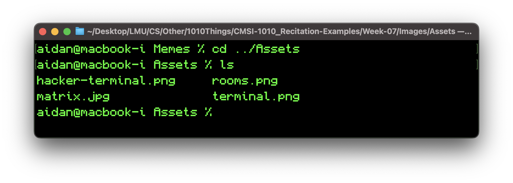

And there we are! `..` let us step *backwards* into `Images`, after which we step *forward* into `Assets`. Confirm your vision with your file explorer, then check our map.

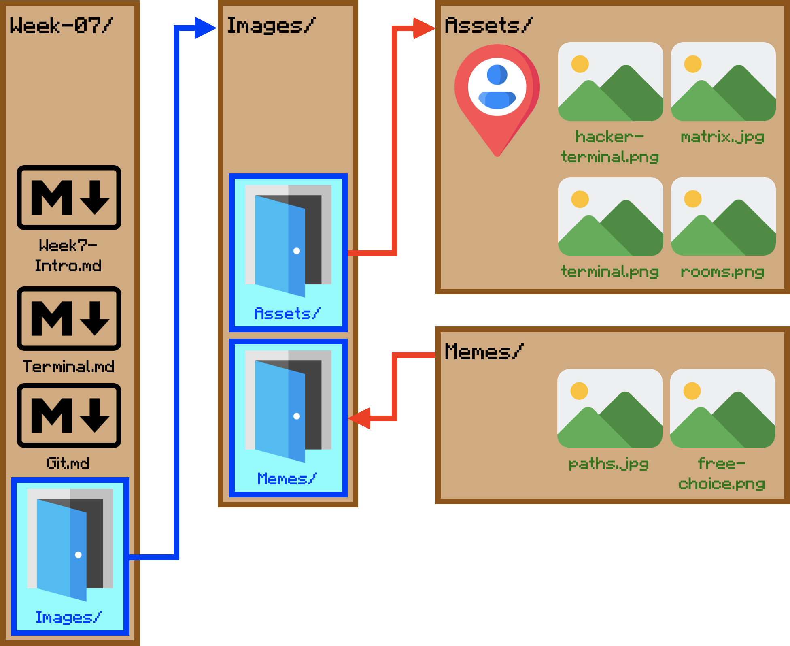

### File Creation

Moving around and peeking into directories is not particularly helpful on its own, so we're going to start managing files, starting with all the ways that you can create new files.

#### `touch` - Create File

> The file creation command `touch [FILENAME]` creates a new file called `FILENAME` in the shell's current directory.

`FILENAME` here includes the file extension: so `.txt`, `.py`, `.png`, etc. As you can see, image, video, or other types of file extensions are valid, but not very helpful since it's hard to use an empty image file.

Keep in mind that your operating system may have certain restrictions on file names, such as not being allowed to use certain characters.

Practice time! Create a new `.txt` file in your current folder (`Assets`) and then check to make sure it's there.

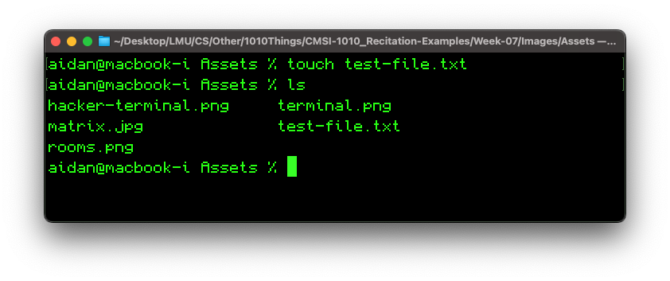

If you want to be really sure, you can open and edit it. It's just a blank text file.

One last thing: `touch` doesn't do anything if a file with the same name already exists in the current directory. Don't worry about deleting an existing file by "overwriting" it with a blank file.

#### `mkdir` - Create Directory

> The make directory command `mkdir [DIRECTORY]` creates a new folder `DIRECTORY` in the shell's current directory.

Like before, your OS may have restrictions on directory names.

Create a new directory inside your current folder and check that it's there.

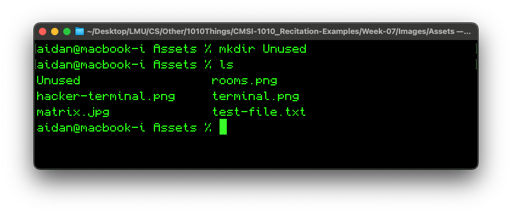

There's not much else to say here -- enjoy your new folder... At least until we learn how to delete files. ;)

#### `cp` - Copy File or Directory

> The copy command `cp [SOURCEFILE] [DESTINATION]` duplicates a file `SOURCEFILE` and places it in `DESTINATION`.

`DESTINATION` can either be a directory or a file name. If it's a directory, the duplicate is placed in that directory. If it's a file name, the copy is placed into the current directory, but renamed. Of course, you can combine them to do both, as we'll see soon.

You've probably done this before: you right-click a file, choose "duplicate" or "copy", and then drag the new file where you want it. `cp` lets you do all that in one fell swoop.

Try copying a file into our newly-made `Unused` directory, then `cd` into `Unused` and check that the copy exists.

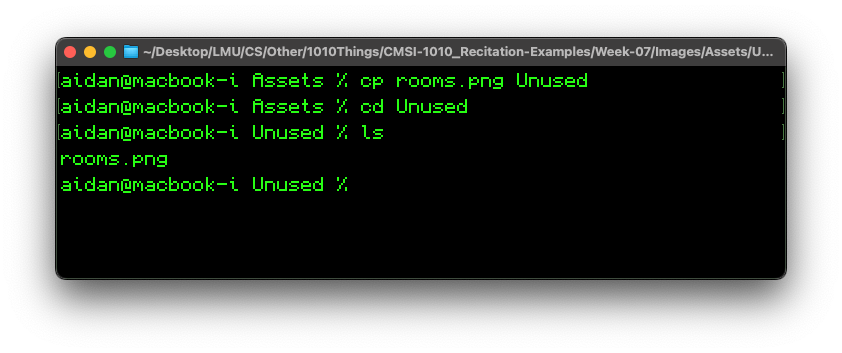

Now back out of `Unused` and try copying *and* renaming a file.

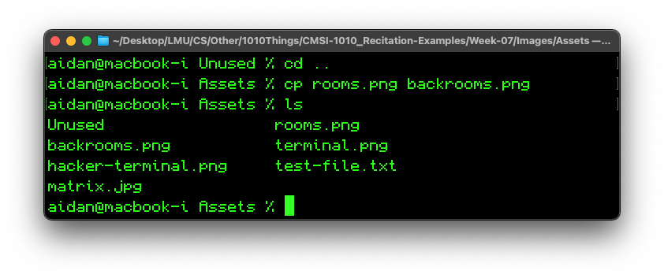

Now try copying `matrix.jpg` into `Unused` while renaming it `old-matrix.jpg`.

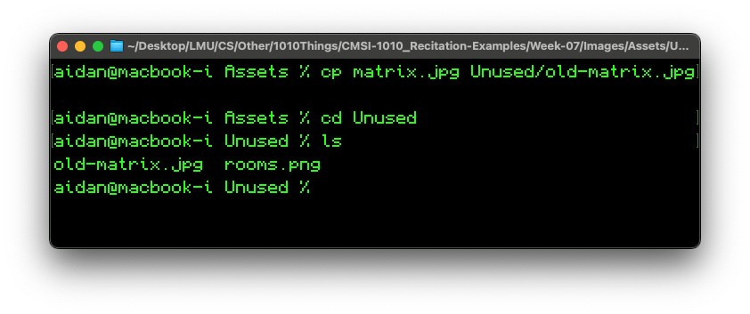

Great! There's just one more important point to make about copying individual files:

> Copying a file `A` onto an existing file `B` **will *overwrite* `B` using the contents in `A`**.

**This is irreversible!** Be very careful about copying files onto existing files if your files are named similarly.

We can also copy directories by using the `-r` tag.

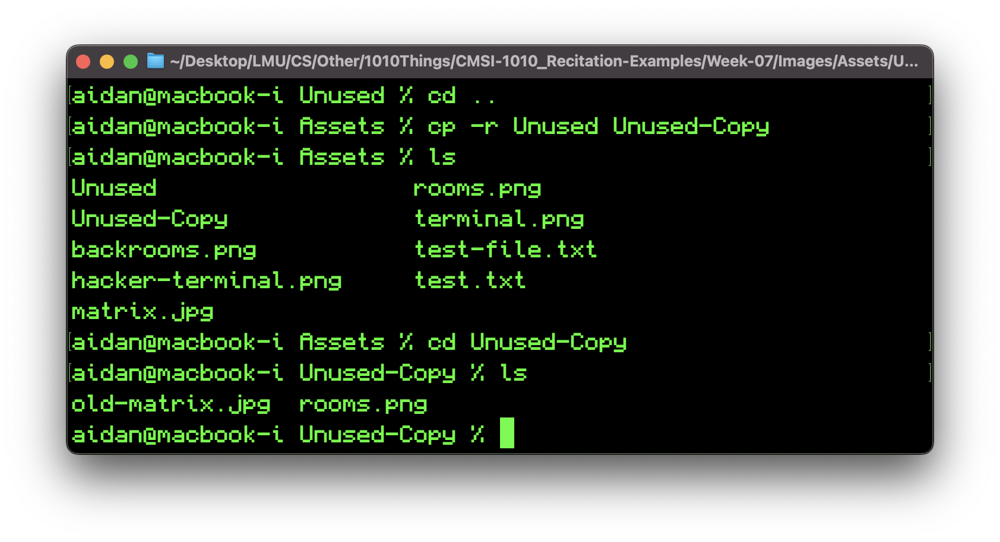

> The `-r` tag stands for "recursive" and applies file-level commands to directories.

We'll only go over two commands that use the `-r` tag. Copy is the first; the second is remove, which we'll get to soon.

### File Management

Creating files is great, but still not enough. Here are our last two terminal commands, and they're exactly what we're missing for your usual file management system.

#### `mv` - Move File or Directory

> The move command `mv [SOURCE] [DIRECTORY]` removes a `SOURCE` from its current location and places it in the `DIRECTORY`.

`SOURCE` can be either a file or a folder. Let's try to consolidate our unused files into one folder.

To do this, we'll need to rename the files in `Unused-Copy` to be something different from the files in `Unused`. Since we just copied the files, their names are identical; if we moved them right now, we'd lose those copies!

Coincidentally, `mv` also lets you rename things!

> The move command can also be used to rename files by providing a filename instead of directory.

We'll use this right now!

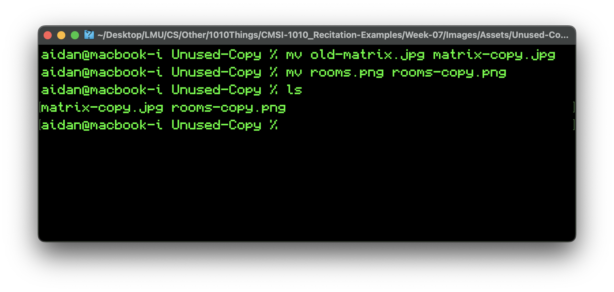

Great! Now we can actually move our files.

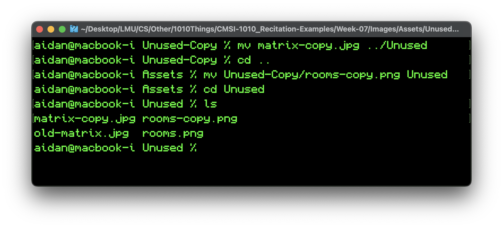

Notice that we're using filepaths, including our `..` operator from before! Files or directories in other directories are entirely valid targets. You don't need to be able to see everything from the room that you're immediately standing in to make use of them.

Lastly, let's move our folders out from `Assets` and into the `Images` folder.

Notice again the filepaths. They might seem a little unusual, so trace them yourself to make sure you understand why they're used in this way.

#### `rm` - Remove File or Directory

> The remove command `rm [SOURCE]` **irreversibly deletes** the file `SOURCE`.

Read that very carefully. With `rm`, there's no warning and no takebacks. That file is gone for good.
