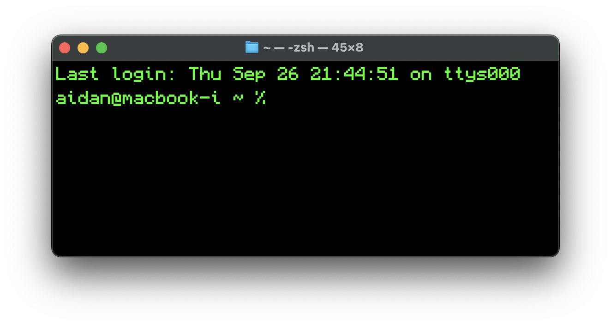
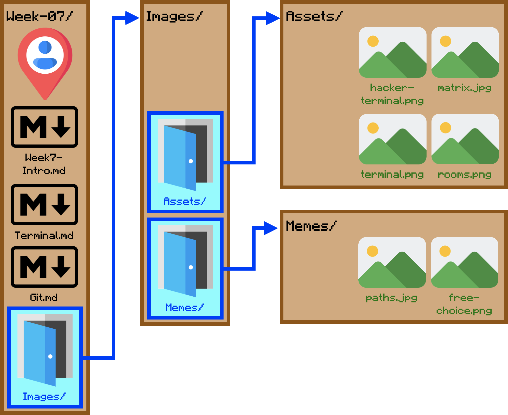

# Terminal

If you've seen pictures of old computers, pictures of "hackers", or *The Matrix* you probably have some idea of what the terminal/command line/shell looks like; colloquially you might also call it "the terminal." In case you don't, here are some examples:

That looks terrifying, doesn't it? It's so high-tech looking and advanced!

And with that, let me show you what my terminal actually looks like when you open it up:

That doesn't look so bad, does it? If you're still scared, that's entirely valid. The command-line is an extremely powerful tool that has the potential to do serious, potentially irreversible damage *if* you go off the beaten path. You shouldn't need to go off the beaten path for this class. Just stay on the path(s) we lay out for you and you'll be fine.

## Command Line vs. Terminal vs. Shell

Let's clear up one key bit of terminology before we start:

> For the purposes of this class, **terminal**, **command line**, and **shell** refer to the same thing: a text-only interface that lets you explore files and execute commands.

All three have varying origins. For example, "terminal" comes from "computer terminals" which were the only way to access a computer or computer network's functions. This isn't information you need to know, but if you're interested you can take a look at [this Reddit post](https://www.reddit.com/r/learnprogramming/comments/6xr0l9/whats_the_difference_between_terminal_shell/) which explains their origins pretty well.

> For consistency, I will be using the term "shell" throughout this and subsequent notebooks.

Your computer should already have some kind of shell built in. If you're on a Mac, you have an app called Terminal; on Windows, the equivalent is Command Prompt. Unfortunately, Mac and Windows have two different shell languages, so **if you're a Windows user we want you to download and use [Git Bash](https://git-scm.com/downloads)** to keep the commands consistent (this installation should have already been done in class).

## Commands

The whole point of your shell is to use commands. Many of them perform functions that your file explorer (called Finder on Mac) are able to do normally, but the shell is capable of going into places that Finder normally hides from you. This also means that it's capable of editing or even deleting items that normally should not be touched.

Once again, you shouldn't have to go into those places for this class, so you shouldn't have to worry about things like deleting System32 or bricking your computer.

### File Navigation

In your computer, your files are set up like Russian dolls. A folder can contain multiple folders and files, and those folders may contain even more folders! The problem with this comparison is that it's hard to imagine putting physical folders inside of other folders. The real term for a "folder" is a *directory*.

> A **directory** is a file on your computer that contains other files, which may also be directories. In other words, directories and folders are the same thing.

A "directory" outside of computing *directs* people to things they need, such as a specific doctor's office in a medical building. That's how they got their name: they direct users to files that were placed in them.

With this in mind, I like to think of your computer and its directories as a house with a bunch of rooms. Each directory is a room; while you're standing in that room, you can only see items in that room (files), doors to the next rooms (directories), or the door you came in from.

Here's a doodle of this analogy in action for the entire "Week 7" folder in this repo:

Let's get started with your navigation commands, using our visual to help us through it.

#### List Items
